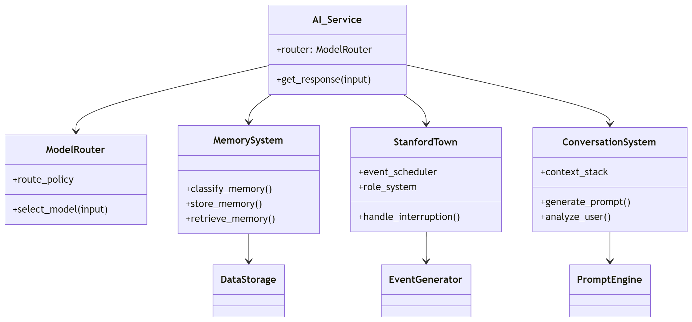
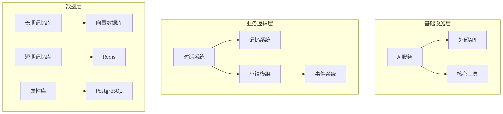

# 文件树设计

```txt
emergent-edge-ai/
├── docs/                    # 文档目录
├── config/                  # 配置文件
│   ├── ai_models.yaml       # AI模型参数配置
│   ├── api_keys.yaml        # API密钥管理
│   └── paths_config.py      # 路径配置
│
├── src/
│   ├── ai_services/         # AI服务统一封装层
│   │   ├── __init__.py
│   │   ├── interfaces/      # 抽象接口
│   │   │   ├── ai_client.py # 统一AI调用接口
│   │   │   └── api_client.py
│   │   │
│   │   ├── adapters/        # 具体实现适配器
│   │   │   ├── qwen_adapter.py
│   │   │   ├── deepseek_adapter.py
│   │   │   └── gpt_adapter.py
│   │   │
│   │   └── routers/         # 路由决策模块
│   │       ├── model_to_url.py
│   │       └── model_router.py
│   │
│   ├── data_management/     # 数据管理层
│   │   ├── databases/       # 数据库抽象层
│   │   │   ├── long_term_memory.py
│   │   │   ├── short_term_memory.py
│   │   │   ├── attributes_db.py
│   │   │   └── event_logs.py
│   │   │
│   │   └── vector_storage/  # 向量存储处理
│   │       ├── embedding_processor.py
│   │       └── faiss_interface.py
│   │
│   ├── memory_management/   # 记忆系统
│   │   ├── memory_processor.py  # 记忆处理流水线
│   │   ├── classifiers/     # 记忆分类器
│   │   │   ├── emotional_classifier.py
│   │   │   └── semantic_classifier.py
│   │   └── storage_adapters/
│   │
│   ├── emotion_simulation/  # 情感模拟系统
│   │   ├── emotion_engine.py
│   │   ├── mood_models/     # 情绪状态模型
│   │   └── evaluation/      # 情感影响评估
│   │
│   ├── anime_scape/       # 斯坦福小镇模块
│   │   ├── core/            # 核心引擎
│   │   │   ├── event_scheduler.py
│   │   │   ├── role_system/ # 角色管理系统
│   │   │   └── environment_simulator.py
│   │   │
│   │   ├── modules/         # 功能模块
│   │   │   ├── event_generator.py
│   │   │   ├── task_system.py
│   │   │   └── interruption_handler.py
│   │   │
│   │   └── utils/           # 小镇工具类
│   │
│   ├── conversation_system/ # 对话系统
│   │   ├── dialog_flow.py   # 对话流程控制
│   │   ├── context_manager.py
│   │   ├── prompt_engine/   # Prompt生成系统
│   │   └── user_analytics.py
│   │
│   ├── external_apis/       # 外部服务封装
│   │   ├── weather_api.py
│   │   ├── time_service.py
│   │   └── emotion_api.py
│   │
│   └── core/                # 核心基础设施
│       ├── utilities/       # 通用工具
│       │   ├── logging_setup.py
│       │   └── cache_manager.py
│       │
│       ├── middleware/      # 中间件层
│       │   ├── auth.py
│       │   └── rate_limiter.py
│       │
│       └── services/        # 基础服务
│           ├── message_broker.py
│           └── task_queue.py
│
├── tests/                   # 测试目录
│   ├── unit_tests/
│   └── integration_tests/
│
├── scripts/                 # 运维脚本
├── requirements.txt         # 依赖管理
└── README.md
```

# 关键模块说明

# 架构分层示意图

