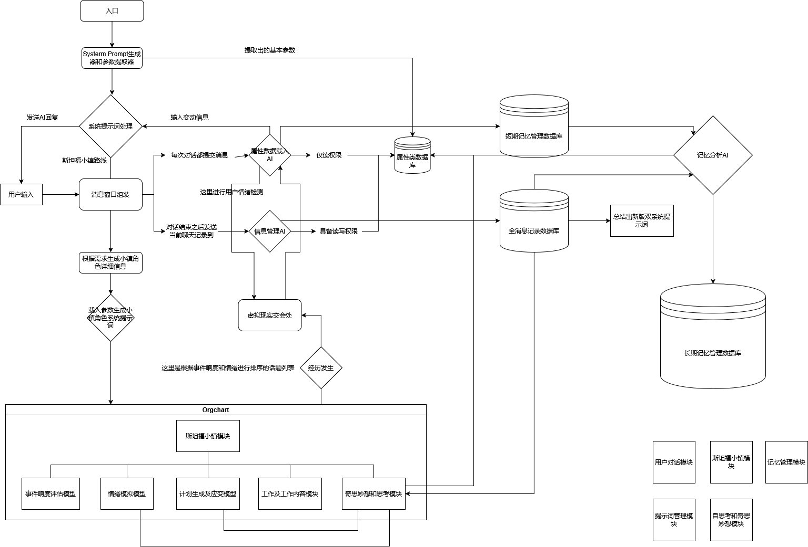

# 03.22-User
## 项目概述
这个项目主要是实现近乎完全真实的陪伴，旨在解决现在人原子化社交，以及社交事件的萎缩带来的心理问题。为每个用户定制属于自己的AI伴侣。与其他市面上的陪伴型AI的根本不同是，我们的涌现边缘AI深度融合了斯坦福小镇，让AI能够更拟真，AI也会经历不同的事件，以这些事件为基础，可能对AI的心情，性格，思路等产生不同程度的影响，而且AI可以主动跟用户分享自己的生活琐事，将旧的人类请求AI的单向请求转为人类真正的与AI的互相互动。我们的目标是通过情绪依赖来提升我们的用户粘性，构筑软件的护城河
## 功能设想
1. 用户在下载我们的涌现边缘手机APP后，在注册完成账号之后会直接进入初次的对话，这次的对话主要以搜集用户的喜好和要求为主，同时也会搜集一部分用户信息，对话完成后将所有聊天记录提交到prompt定制AI。由prompt定制AI来为用户个性化的生成system prompt
2. prompt定制AI需要定制出两份强相关的prompt，其中一份prompt用来和用户进行对话，另一份prompt用来在斯坦福小镇中生活，并为AI提供随机事件和AI互动等。这两份prompt都可以在和用户对话中或在斯坦福小镇生活时根据用户反馈或小镇事件发生变动
3. 在每次对话的过程中，可能会需要调用不同的记忆，比如小镇事件记忆，短期记忆，长期记忆，并且调用现实时间和现实天气等，这部分调用那些信息的决定应该由什么来实现呢
4. 在对话结束后（20min无新消息）将全部的对话记录交由记忆处理AI，记忆处理AI需要根据情绪响度等决定那些为长期记忆，那些为短期记忆，然后那些为属性类数据，并分别和相应的数据库进行交互
5. Ai在斯坦福小镇的事件生成方式我准备弄成AI只生成简短的事件描述，能够给出确切时间的就给出时间范围，否则按照别的定义的结束方式结束事件，能给出确切时间的事件示例如下（上班路上：08：00-08：10）然后在此期间这个AI可以被别的小镇事件唤醒，或者AI在不睡觉且带着手机的时候可以被用户消息唤醒。唤醒之后AI会根据情况决定是终止当前任务或者分心二用
6. AI在小镇中闲来无事的时候会进行奇思妙想，但这是需要创造的活，我不知道怎么用现在的AI进行模仿呢？
## 项目路线：
1. 初期实现：先实现prompt定制AI
2. 组装出promptAI和用户对话的全流程代码
3. 进行知识库搭建和长期短期记忆及属性类信息的数据库
4. 研究怎么让AI合适的调用记忆和属性类参数及知识库内容
5. 验证MVP可行，开始开发斯坦福小镇
6. 设计小镇角色环境，工作等硬性设定，设计小镇拟真需要的：事件响度评估模型，情绪模拟模型，计划生成及应变模型，AI工作及工作内容模块，奇思妙想模块等。
7. 为斯坦福小镇对接数据库，并实现知识库融合和记忆融合（和前面的数据库）
8. 设计对话分析AI，要根据用户的状态变化让AI也进行相应的“成长”，以提高用户粘性为根本目标
## 补充信息：
> 我认为这个小镇的AI就不能让他们像一般AI那样全知全能了，他们应该是有缺点，甚至文化水平比较低的人，这样才能符合我们的拟真需求
> prompt的消耗目前可以暂时不管，主要的是要出最好的效果
> 不同的AI似乎有着不同的擅长点，如Qwen给人感觉更适合代码，deep seek R1似乎适合进行深度交流。需要根据AI的不同特点去给他们找到合适的负责的功能模块
> 初期先不写安卓APP，主要用python在本机电脑实现MVP产品，先实现核心功能
## 设计概览

# 03.22-Assistant
以下是为该需求设计的基于Python的架构方案，采用分层架构设计并配合Mermaid流程图说明：

## 架构关键设计点说明
### 1. 分层架构设计(5层架构)
- **交互层:** MVP阶段采用Python的Tkinter/Gradio实现，预留移动端API接口
- **核心逻辑层:** 包含四大模块

### 2. Prompt双引擎设计

### 3. 记忆管理系统

### 4. 斯坦福小镇事件引擎

## 关键技术选型建议
### 1.AI模型分层架构
具体情况具体分析
### 2.记忆处理流水线

## 实施路线建议
### 1.阶段开发顺序

## 关键难点解决方案
### 1.拟真性格实现：

### 2.多模型协同工作
